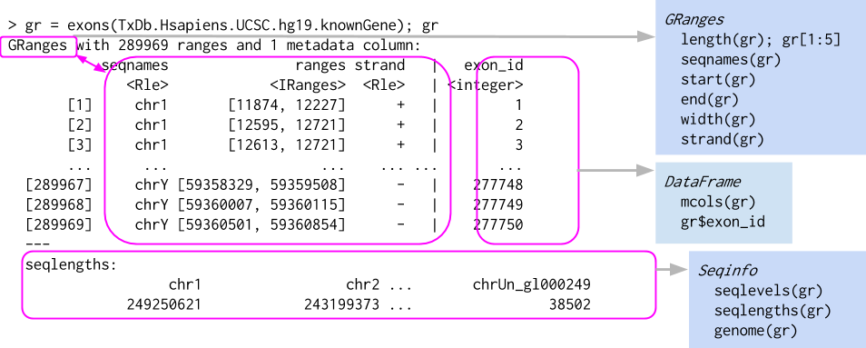

```{r style, echo = FALSE, results = 'asis'}
knitr::opts_chunk$set(
    eval=as.logical(Sys.getenv("KNITR_EVAL", "TRUE")),
    cache=as.logical(Sys.getenv("KNITR_CACHE", "TRUE")))
```

```{r setup, echo=FALSE}
suppressPackageStartupMessages({
    library(Biostrings)
    library(GenomicRanges)
    library(SummarizedExperiment)
    library(DESeq2)
})
```

# Introduction

Started 2002 as a platform for understanding analysis of microarray
data

1,560 software packages. Domains of expertise:

- Sequencing (RNASeq, ChIPSeq, single-cell, called variants, ...)
- Microarrays (methylation, expression, copy number, ...)
- flow cytometry
- proteomics
- ...

Important themes

- Reproducible research
- Interoperability between packages & work flows
- Usability

Resources

- https://bioconductor.org

  - Install, learn, use, develop

- https://bioconductor.org/packages

  - Software (e.g., [DESeq2][]), annotation (e.g., [org.Hs.eg.db][], [TxDb.Hsapiens.UCSC.hg38.knownGene][]), experiment (e.g., [curatedTCGAData][]), workflow (e.g., [simpleSingleCell][])
  - biocViews to navigate / discover
  - Package landing pages. Author, description, citation.
  - Vignettes
  
      ```{r, eval = FALSE}
      browseVignettes(package = "DESeq2")
      ```

  - Installation

    ```{r, eval = FALSE}
    if (!requireNamespace("BiocManager", quietly = TRUE))
        install.packages("BiocManager")
    BiocManager::install("DESeq2")
    ```

- https://support.bioconductor.org

[DESeq2]: https://bioconductor.org/packages/DESeq2
[org.Hs.eg.db]: https://bioconductor.org/packages/org.Hs.eg.db
[TxDb.Hsapiens.UCSC.hg38.knownGene]: https://bioconductor.org/packages/TxDb.Hsapiens.UCSC.hg38.knownGene
[curatedTCGAData]:  https://bioconductor.org/packages/curatedTCGAData
[simpleSingleCell]:  https://bioconductor.org/packages/simpleSingleCell

# Three important classes

## DNA Sequences

[Biostrings][] themes

- _Valid_ data, e.g., alphabet
- 'Vector' interface: `length()`, `[`, ...
- Specialized operations, e.g,. `reverseComplement()`

```{r}
library(Biostrings)

dna <- DNAStringSet(c("AAACTG", "CCCTTCAAC", "TACGAA"))
dna

length(dna)
dna[c(1, 3, 1)]

width(dna)
reverseComplement(dna)
```

Help!

```{r, eval=FALSE}
methods(class="DNAStringSet")
?"DNAStringSet"
browseVignettes(package="Biostrings")
```

## Genomic Ranges



[GenomicRanges][]

- Data (e.g., aligned reads, called peaks, copy number)
- Annotations (e.g., genes, exons, transcripts)
- Close relation to BED files (see `rtracklayer::import.bed()` and
  [HelloRanges][])
- Also vector interface -- `length()`, `[`, etc.

```{r}
library(GenomicRanges)

gr <- GRanges(c("chr1:100-120", "chr1:115-130", "chr2:200-220"))
gr
```

Intra-range operations

- e.g., `shift()`, `narrow()`, `flank()`

Inter-range operations

- e.g., `reduce()`, `coverage()`, `gaps()`, `disjoin()`

Between-range operations

- e.g., `countOverlaps()`, `findOverlaps()`, `summarizeOverlaps()`

```{r}
shift(gr, 1)

reduce(gr)

anno <- GRanges(c("chr1:110-150", "chr2:150-210"))
countOverlaps(anno, gr)
```

Help!

```{r, eval=FALSE}
methods(class="GRanges")
methods(class="GRangesList")
?"GRanges"
?"GRangesList"
browseVignettes(package="GenomicRanges")
```

### Lists of Genomic Ranges


- e.g., exons-within-transcripts, alignments-within-reads

## Summarized Experiments


Component parts

- three components -- underlying 'matrix', 'row' annotations (genomic
  features), 'column' annotations (sample descriptions)

```{r}
counts <- read.csv("data/airway_counts.csv", row.names=1)
counts <- as.matrix(counts)
head(counts, 3)

colData <- read.csv("data/airway_colData.csv", row.names=1)
colData[, 1:4]

rowRanges <- readRDS("data/airway_rowRanges.rds")
rowRanges
```

Could manipulate independently...

```{r, fig.asp=1}
cidx <- colData$dex == "trt"
plot(
    rowMeans(1 + counts[, cidx]) ~ rowMeans(1 + counts[, !cidx]),
    log="xy"
)
```

- very fragile, e.g., what if `colData` rows had been re-ordered?

Solution: coordinate in a single object -- [SummarizedExperiment][]

```{r, fig.asp=1}
library(SummarizedExperiment)

se <- SummarizedExperiment(counts, rowRanges = rowRanges, colData = colData)
cidx <- se$dex == "trt"
plot(
    rowMeans(1 + assay(se)[, cidx]) ~ rowMeans(1 + assay(se)[, !cidx]),
    log="xy"
)
```

- Much more robust to 'bookkeeping' errors
- matrix-like interface: `dim()`, two-dimensional `[`, ...
- accessors: `assay()`, `rowData()` / `rowRanges()`, `colData()`, ...

Help!

```{r, eval=FALSE}
methods(class="SummarizedExperiment")
?"SummarizedExperiment"
browseVignettes(package="SummarizedExperiment")
```

# Domain analysis, e.g., bulk RNA-seq differential expression

In this final section we quickly hint at down-stream analysis, and the way in which skills learned in working with _Bioconductor_ objects in one package translate to working with objects in other packages.

## High-throughput sequence work flow -- overview


## Working with summarized experimental data

The `SummarizedExperiment` coordinates assays with (optional) descriptions of rows and columns. We start by reading in a simple `data.frame` describing 8 samples from an RNASeq experiment looking at dexamethasone treatment across 4 human smooth muscle cell lines; use `browseVignettes("airway")` for a more complete description of the experiment and data processing. Read the column data in using `file.choose()` and `read.csv()`.

```{r, eval=FALSE}
fname <- file.choose()  # airway_colData.csv
fname
```

```{r, echo=FALSE}
fname <- "data/airway_colData.csv"
```
We want the first column the the data to be treated as row names (sample identifiers) in the `data.frame`, so `read.csv()` has an extra argument to indicate this.

```{r}
colData <- read.csv(fname, row.names = 1)
colData
```

The data are from the Short Read Archive, and the row names, `SampleName`, `Run`, `Experiment`, `Sampel`, and `BioSample` columns are classifications from the archive. Additional columns include:

- `cell`: the cell line used. There are four cell lines.
- `dex`: whether the sample was untreated, or treated with dexamethasone.
- `albut`: a second treatment, which we ignore
- `avgLength`: the sample-specific average length of the RNAseq reads estimated in the experiment.

**Assay data**

Now import the assay data from the file "airway_counts.csv"

```{r, eval=FALSE}
fname <- file.choose()  # airway_counts.csv
fname
```

```{r, echo=FALSE}
fname <- "data/airway_counts.csv"
```

```{r}
counts <- read.csv(fname, row.names=1)
```

Although the data are read as a `data.frame`, all columns are of the same type (integer-valued) and represent the same attribute; the data is really a `matrix` rather than `data.frame`, so we coerce to matrix using `as.matrix()`.

```{r}
counts <- as.matrix(counts)
```

We see the dimensions and first few rows of the counts matrix

```{r}
dim(counts)
head(counts)
```

It's interesting to think about what the counts mean -- for ENSG00000000003, sample SRR1039508 had 679 reads that overlapped this gene, sample SRR1039509 had 448 reads, etc. Notice that for this gene there seems to be a consistent pattern -- within a cell line, the read counts in the untreated group are always larger than the read counts for the treated group. This and other basic observations from 'looking at' the data motivate many steps in a rigorous RNASeq differential expression analysis.

**Creating a `SummarizedExperiment` object**

We saw earlier that there was considerable value in tightly coupling the count of CpG islands overlapping each transcript with the `GRanges` describing the transcripts. We can anticipate that close coupling of the column data with the assay data will have similar benefits, e.g., reducing the chances of bookkeeping errors as we work with our data.

Attach the [SummarizedExperiment][] library to our _R_ session.

```{r, message=FALSE}
library("SummarizedExperiment")
```

Use the `SummarizedExperiment()` function to coordinate the assay and column data; this function uses row and column names to make sure the correct assay columns are desribed by the correct column data rows.

```{r}
se <- SummarizedExperiment(assay = counts, colData = colData)
se
```

It is straight-forward to use `subset()` on `SummarizedExperiment` to create subsets of the data in a coordinated way. Remember that a `SummarizedExperiment` is conceptually two-dimensional (matrix-like), and in the example below we are subsetting on the second dimension.

```{r}
subset(se, , dex == "trt")
```

As with `GRanges`, there are accessors that extract data from the `SummarizedExperiment`. For instance, we can use `assay()` to extract the count matrix, and `colSums()` to calculate the library size (total number of reads overlapping genes in each sample).

```{r}
colSums(assay(se))
```

Note that library sizes differ by a factor of 2 from largest to smallest; how would this influence the interpretation of counts in individual cells of the assay data?

As with `GRanges`, it might be useful to remember important computations in a way that is robust, e.g., 

```{r}
se$lib.size <- colSums(assay(se))
colData(se)
```

## From SummarizedExperiment to top table of differentially expressed genes

We start by loading the [DESeq2][] package, a very popular facility for analysing bulk RNAseq differential experssion data.

```{r, message=FALSE}
library("DESeq2")
```

The package requires count data like that in the `SummarizedExperiment` we have been working with, in addition to a `formula` describing the experimental design. Some of the observations above suggest that we should include cell line as a covariate, and dexamethazone treatment as the main factor that we are interested in.

```{r}
dds <- DESeqDataSet(se, design = ~ cell + dex)
dds
```

The `dds` object can be manipulated very much like a `SummarizedExperiment`.

The essention DESeq work flow is summarized by a single function call, which performs advanced statistical analysis on the data in the `dds` object.

```{r}
dds <- DESeq(dds)
```

A table summarizing measures of differential expression can be extracted from the object, and visualized or manipulated using commands we learned earlier today.

```{r}
results(dds)
```

# _Bioconductor_ packages for high-throughput genomic analysis

Web site, https://bioconductor.org

1562 'software' packages, https://bioconductor.org/packages

- Sequence analysis (RNASeq, ChIPSeq, called variants, copy number, 
  single cell)
- Microarrays (methylation, copy number, classical expression, ...)
- Annotation (more about annotations later this morning...)
- Flow cytometry
- Proteomics, image analysis, ...

Discovery and use, e.g., [DESeq2][]

- https://bioconductor.org/packages
- Landing pages: title, description (abstract), installation instructions,
  badges
- Vignettes!
- [Workflows][], [course material][], [videos][], ...

Support site, https://support.bioconductor.org

[Biostrings]: https://bioconductor.org/packages/Biostrings
[GenomicRanges]: https://bioconductor.org/packages/GenomicRanges
[rtracklayer]: https://bioconductor.org/packages/rtracklayer
[HelloRanges]: https://bioconductor.org/packages/HelloRanges
[SummarizedExperiment]: https://bioconductor.org/packages/SummarizedExperiment
[DESeq2]: https://bioconductor.org/packages/DESeq2
[Workflows]: https://bioconductor.org/packages/release/BiocViews.html#___Workflow
[course material]: https://bioconductor.org/help/course-materials/
[videos]: https://www.youtube.com/user/bioconductor

# End matter

## Session Info

```{r}
sessionInfo()
```

## Acknowledgements

Research reported in this tutorial was supported by the National Human
Genome Research Institute and the National Cancer Institute of the
National Institutes of Health under award numbers U41HG004059 and
U24CA180996.

This project has received funding from the European Research Council
(ERC) under the European Union's Horizon 2020 research and innovation
programme (grant agreement number 633974)
